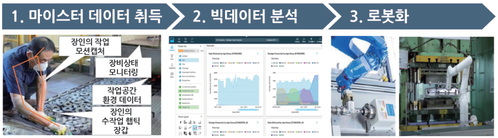

# 빅데이터 활용 마이스터 로봇화 개요

## 사업개요
- 국내 SI기업이 旣구축한 뿌리기계*에 빅데이터ㆍ로봇 기술을 적용하여 숙련공의 현장노하우(암묵지)를 디지털화ㆍ자동화하기 위한 마이스터 로봇화 기반 구축
  - 동 사업에서 뿌리기계는 3대 산업분야(금속가공, 전자·전기, 자동차부품)의 주조, 단조, 압출, 사출, 용접, 표면처리, 열처리 등의 뿌리공정에 활용되는 기계·장비임

     

## 필요성

- 뿌리산업은 제조업 일자리 창출에 중추적 역할을 하고 있으며, 제조업종 전반의 근간을 이루는 핵심 산업이나 경쟁력이 급감하고 있어 지원 시급
  - 고령화, 열악한 근무환경*, 고용여력 감소 등으로 인해 경쟁력 약화
    - 2-30대 비중 감소, 4-50대 비중 증가 (40대 이상이 전체 종사자의 60%), 수작업 공정이 많고 먼지·악취·소음 발생 심각 (열악한 환경으로 인해 취업 기피, 외국인 노동자 비중 급증(‘12년 24,935명 → ’16년 42,443명))
 - 뿌리산업은 숙련공에 대한 의존도가 높은 산업으로 코로나19 등 전염병에 대비하여 숙련공의 암묵지를 디지털 자산화*하고 공정의 자동화를 통해 생산성 개선이 매우 시급한 분야
    - 日 NEDO는 중소제조기업 내 숙련 노동자의 기술 및 노하우를 DB화하는 사업을 진행(’01∼’17)한 바 있으며, ’20년 이를 통해 구축된 기반 기술 및 데이터를 토대로 AI 기술과 융합시키는 ‘암묵지의 표면화 전승을 지원하는 인간 협조 AI 기반 기술 개발’ 사업(’20∼’24)을 시작

- 뿌리산업은 개인이 체화한 노하우 등 암묵지식이 많은 분야로, 타 제조업 대비 데이터화 및 활용이 더욱 중요해 디지털 전환을 위한 기반구축이 시급히 요구
  - 그러나, 뿌리기업의 88.8%가 수집된 데이터를 활용하지 못하고 있으며(2018년 뿌리산업 실태조사 보고서(국가뿌리산업진흥센터)), IT역량이 미흡한 영세기업이 많아 공공硏을 활용한 정부 지원사업을 통해 데이터 활용 및 디지털 전환 촉진 필요