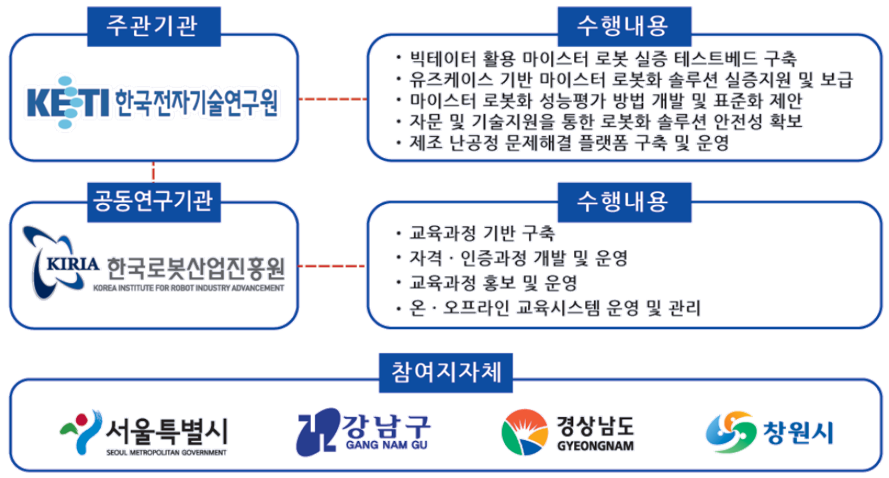

# 사업목표 및 추진체계

## 사업 목표
- 빅데이터 활용 마이스터 로봇화 실증 테스트베드 구축, 실증 성능 평가 기준 개발 및 보급 지원, 전문 인력 양성을 통한 스마트 제조환경 구축 및 확산
   - 마이스터 로봇화 실증 테스트베드 구축 및 기술지원, 성능평가 방법 개발 및 안전성 확보방안 지원, 전문인력 양성지원 등을 통해 제조공정시스템 로봇화 전문기업 육성

## 사업 추진체계

### 주관기관
- [한국전자기술연구원](https://www.keti.re.kr)

### 공동연구개발기관
- [한국로봇산업진흥원](https://www.kiria.org/)

### 참여지자체
- [서울특별시](https://www.seoul.go.kr/)
- [강남구](https://www.gangnam.go.kr/)
- [경상남도](https://www.gyeongnam.go.kr/)
- [창원시](https://www.changwon.go.kr/)