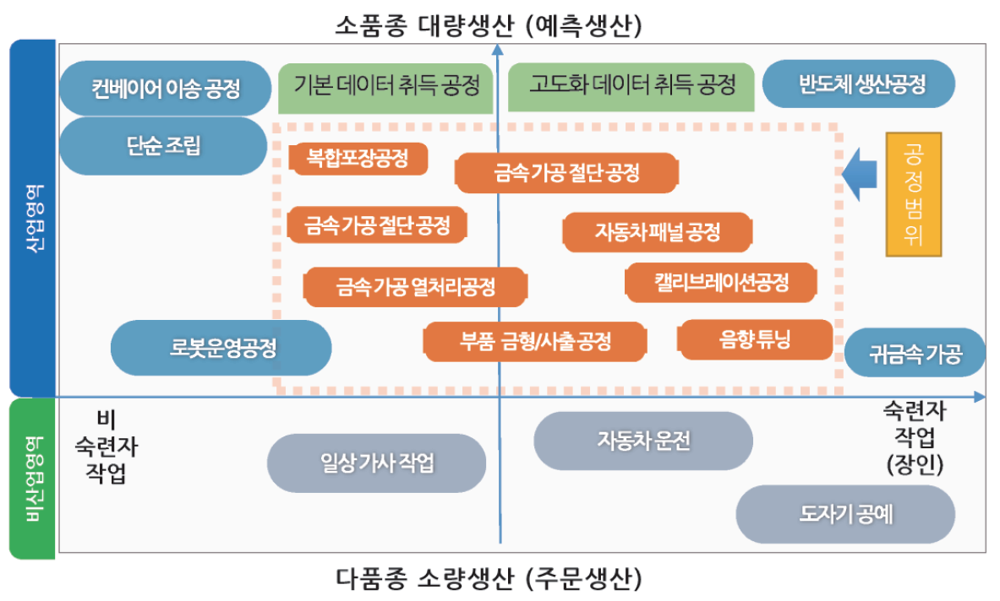
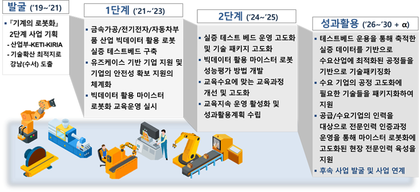

# 사업개요

## 사업개요 및 목표
- **(사업개요)** 빅데이터 활용 마이스터 로봇화 기술개발 및 보급을 위한 실증 인프라 구축 및 테스트베드 지원
- **(사업목표)** 빅데이터 활용 마이스터 로봇화 실증 테스트베드 구축, 실증 성능 평가 기준 개발 및 보급 지원, 전문 인력 양성을 통한 스마트 제조환경 구축 및 확산  
  - 3대 산업분야(금속가공, 자동차부품, 전자‧전기)의 뿌리공정분야에서 숙련공 현장노하우의 디지털화ㆍ자동화를 통해 공정의 스마트화‧로봇화가 시급한 주요 공정 분석 
- **(사업기간)** 2021년 ~ 2025년

## 적용 대상 공정 범위

## 주요사업내용
- **(빅데이터 활용 마이스터 로봇 실증 테스트베드/장비 구축)** 주관기관이 보유한 스마트화․로봇화 기반기술을 활용하여 뿌리산업 중소기업이 장인의 데이터를 손쉽게 취득할 수 있는 관련 테스트베드/장비 구축
- **(빅데이터 활용 마이스터 로봇 표준/성능평가 방법 개발)** 구축된 뿌리기계 공정시스템 스마트화‧로봇화 솔루션 기술의 성능평가 방법과 관련 표준 개발 등록
- **(운용기술 개발 및 기업지원 보급)** 본 기술의 솔루션 패키지화 및  기술의 현장적용 확대를 위한 기업지원 및 사례 발굴
- **(빅데이터 활용 마이스터 로봇 전문인력 양성)** 디지털 장인화 기반기술이 제조분야의 공정시스템 고도화에 활용될 수 있도록 교육기반 마련 및 교육운영을 통한 빅데이터 로봇화 전문인력양성 

## 사업로드맵
- 단계별 구축 테스트베드/장비 기반 마이스터 로봇화 보급 및 지속 지원

