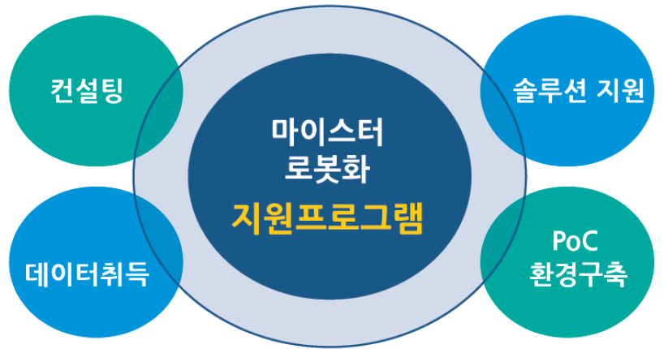
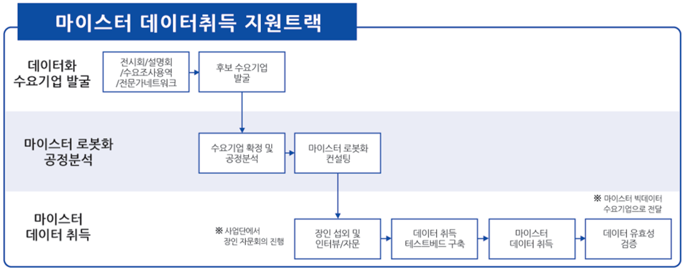

# 마이스터 로봇화 도입 및 기업지원

## 지원대상
- 비교적 다품종 소량생산 형태의 특성을 가지는 뿌리산업 공정과 중소기업 제조 공정 대상 
- 노하우 단절/인력난이 예상되는 3대 산업분야 공정 적용 후 타 분야 중소 제조 공정으로 확산

## 마이스터 데이터취득 지원트랙

## 마이스터 로봇화 PoC 지원트랙

## 테스트 베드 구축
- 강남구 수서동 인근 예정